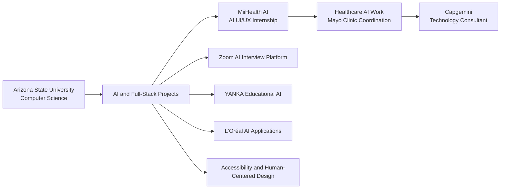

````md
<p align="left">
  
</p>

<h1 align="center">Hi, I'm Advikaa Kapil 👋</h1>

<h3 align="center">
  Technology Consultant • AI Product Designer • Full-Stack Developer
</h3>

<p align="center">
  <strong>Computer Science Graduate from Arizona State University</strong>
</p>

<p align="center">
  I build AI-powered digital products that combine engineering, thoughtful design,
  creativity, accessibility, and human-centered problem solving.
</p>

<p align="center">
  <a href="https://www.linkedin.com/in/akapil1/">
    
  </a>
  <a href="https://advikaakapil.netlify.app/">
    
  </a>
  <a href="mailto:advikaakapil2022@gmail.com">
    
  </a>
</p>

---

## 👩‍💻 About Me

I am a Computer Science graduate from **Arizona State University** with experience across artificial intelligence, full-stack development, UI/UX design, educational technology, healthcare technology, and accessibility-focused digital products.

Most recently, I worked as an **AI UI/UX Intern at MiiHealth AI**, where I contributed to clinical AI governance platforms, provider reporting tools, AI quality assurance workflows, and healthcare-focused product experiences developed in coordination with **Mayo Clinic**.

I am joining **Capgemini as a Technology Consultant**, where I will continue exploring enterprise technology, digital transformation, artificial intelligence, and human-centered product development.

My work sits at the intersection of:

- 🤖 Artificial Intelligence
- 🎨 UI/UX and Product Design
- 💻 Software Engineering
- 🩺 Healthcare Technology
- 🎓 Educational Technology
- ♿ Accessibility
- ✨ Creativity and Visual Storytelling

---

## ✨ What My Work Contains

<p align="center">
  
</p>

<p align="center">
  <strong>AI + Engineering + Design + Creativity + Empathy</strong>
</p>

<p align="center">
  <em>Building intelligent products that feel intuitive, accessible, and human.</em>
</p>

---

## 🧠 My Creative-Tech Mix

<p align="center">
  
</p>

---

## 🎨 My Work DNA

<p align="center">
  
  
</p>

<p align="center">
  
  
</p>

<p align="center">
  
  
</p>

---

## 💼 Experience

### 💼 Incoming Technology Consultant — Capgemini

Joining Capgemini as a Technology Consultant to contribute to enterprise technology solutions, digital transformation initiatives, software development, data-driven products, and AI-powered experiences.

---

### 🏥 AI UI/UX Intern — MiiHealth AI

Worked on healthcare AI products and clinical governance experiences, including:

- Designed an AI governance dashboard for clinical AI systems
- Created provider-facing reporting and review workflows
- Designed protocol testing, findings, scorecards, and sign-off interfaces
- Improved the presentation of complex AI evaluation data
- Created interfaces for healthcare quality assurance and release governance
- Collaborated with product, engineering, design, and AI stakeholders
- Contributed to healthcare AI work developed in coordination with **Mayo Clinic**
- Focused on making clinical AI systems understandable, trustworthy, and human-centered

---

## 🚀 Current Focus

- Building AI-powered applications using large language models
- Exploring Agentic AI and AI governance
- Designing healthcare and enterprise technology products
- Creating accessible and intuitive digital experiences
- Combining product strategy with software engineering
- Developing full-stack applications with modern frameworks
- Learning more about enterprise consulting and digital transformation

---

## 🛠️ Tech Stack

### Frontend

<p>
  
</p>

### Backend and Databases

<p>
  
</p>

### Cloud, Deployment and Development Tools

<p>
  
</p>

### Design and Product

<p>
  
</p>

**Additional skills:** OpenAI API, Prompt Engineering, AI Feature Design, AI Governance, Conversational AI, REST APIs, Responsive Design, Product Thinking, Wireframing, Prototyping, Accessibility and Data Visualization.

---

## ⭐ Featured Projects

### 🎤 Zoom AI Mock Interview Platform

A full-stack AI interview preparation platform that personalizes interview questions using a user's resume and job description.

The platform provides structured AI feedback, performance scores, strengths, and improvement recommendations. It also supports an integrated Zoom experience with adaptive input handling.

**Built with:** Next.js, Node.js, OpenAI API and Vercel

🔗 [View the AI Interview Platform](https://ai-interview-prep-seven-bice.vercel.app/)

---

### 🎬 Zoom AI Interview Prep Showcase Website

A cinematic and responsive showcase website created to present the Zoom AI Interview Prep platform.

The experience includes:

- Cinematic hero design
- Blur and vignette effects
- Smooth scrolling animations
- Interactive product sections
- Demo-focused storytelling
- Responsive layouts

🔗 [View the Showcase Website](https://zoom-ai-showcase.vercel.app/)

---

### 💄 L'Oréal AI Routine Builder

An AI-powered skincare application that creates personalized routines based on user preferences, selected products, and structured inputs.

The application uses OpenAI to generate dynamic and personalized recommendations.

🔗 [View the Routine Builder](https://akapil1.github.io/loreal-ai-routine-builder/)

---

### 💄 L'Oréal AI Beauty Advisor

An AI-powered conversational beauty assistant that provides personalized skincare, makeup, and product recommendations.

The experience was designed to simulate a real-world digital product advisor through dynamic and user-driven interactions.

🔗 [View the Beauty Advisor](https://akapil1.github.io/loreal-ai-beauty-advisor/)

---

### 🎓 YANKA — AI Educational Assistant

A multilingual AI-powered educational platform designed to make learning more accessible through conversational AI, voice, video, and interactive experiences.

The project combines:

- Artificial intelligence
- Educational technology
- Accessibility
- Human-centered UI/UX
- Full-stack development

🔗 [View YANKA](https://yanka-ai-edu-assistant.vercel.app/)

---

### 🚀 NASA Space Explorer

An interactive web application that integrates with NASA's Astronomy Picture of the Day API.

Features include:

- Real-time API data
- Date-based image search
- Dynamic content rendering
- Responsive interface
- Space imagery exploration

🔗 [View NASA Space Explorer](https://akapil1.github.io/nasa-space-explorer-app/)

---

### ✨ Nitasha Tarot Website

An immersive portfolio and service website designed for a tarot reader.

The website includes:

- Spiritual visual branding
- Responsive layouts
- Testimonials
- Educational content
- Booking-focused user journeys

🔗 [View the Tarot Website](https://tarotwithnitasha.netlify.app/)

---

### 💼 Skill Vibez Consulting Website

A professional consulting website focused on communication coaching, personal development, credibility, branding, and booking-driven user experiences.

🔗 [View Skill Vibez](https://skillvibeswithrekha.netlify.app/)

---

### 💧 Water Quest Game

An interactive educational web game inspired by charity: water.

The game raises awareness about access to clean water through:

- Real-time scoring
- Countdown timer
- Win and lose logic
- Responsive gameplay
- Interactive storytelling

🔗 [Play Water Quest](https://akapil1.github.io/charity-water-interactive-game/)

---

### 🌸 Fran's Flowers Website

A modern website redesign for a locally owned flower shop, focused on improving branding, usability, responsiveness, and customer experience.

🔗 [View Fran's Flowers](https://akapil1.github.io/frans-flowers-website/)

---

## 🗺️ My Journey



---

## 📊 GitHub Analytics

<p align="center">
  

  
</p>

---

## 📈 Development Activity

<p align="center">
  
</p>

<p align="center">
  
</p>

---

## 🏆 GitHub Achievements

<p align="center">
  
</p>

---

## 🐍 Contribution Journey

<p align="center">
  
</p>

> The contribution snake requires a GitHub Actions workflow. Remove this section until the workflow has been added to the profile repository.

---

## 🌱 Areas I Care About

- Artificial Intelligence
- Human-Centered AI
- Healthcare Technology
- AI Governance
- Product Design
- Full-Stack Development
- Accessible Technology
- Educational Technology
- Digital Transformation
- Creative Technology
- Data Visualization
- Enterprise Technology

---

## 💡 My Product Philosophy

> Technology should not only be intelligent.  
> It should be understandable, accessible, visually thoughtful, and genuinely useful.

I enjoy translating complex systems into digital experiences that feel simple, clear, engaging, and human.

---

## 📫 Connect With Me

<p align="center">
  <a href="https://www.linkedin.com/in/akapil1/">
    
  </a>
</p>

<p align="center">
  <a href="https://advikaakapil.netlify.app/">
    
  </a>
</p>

<p align="center">
  <a href="mailto:advikaakapil2022@gmail.com">
    
  </a>
</p>

---

<h3 align="center">
  Building technology where artificial intelligence meets thoughtful design.
</h3>

<p align="center">
  ✨ Always building. Always learning. Always creating impact.
</p>
````
